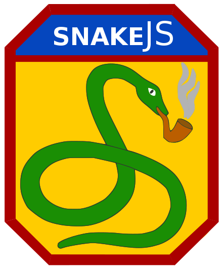
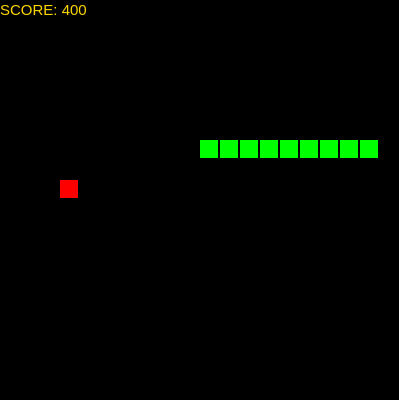

# Snake JS - Canvas/JavaScript based Snake Game.

	
	

Features:

- Score tracking.
- Gamepad support for the following:
	- SNES (Tested on [Mayflash/Huijia USB Adapter](http://a.co/0zO06aL) and confirmed working)
	- PS4 (Tested and confirmed working)
	- PS3 (Not tested but should work)
	- XBOX ONE (Not tested but should work)
	- XBOX 360 (Not tested but should work)

- Snake can wrap around edge of game area.
- Ability to pause game.
- Developed in Canvas and JavaScript.

How to run:

As a Desktop Application (recommended):
- Linux
1. Clone the Repository.
2. Navigate to the `dist` folder.
3. Run the `snake.js-0.0.1-x86_64.AppImage` file.

In Browser: (Only tested and confirmed working on Chrome v63)
1. Clone the Repository.
2. Visit `snake.html` in the `src` folder in Google Chrome. :video_game: